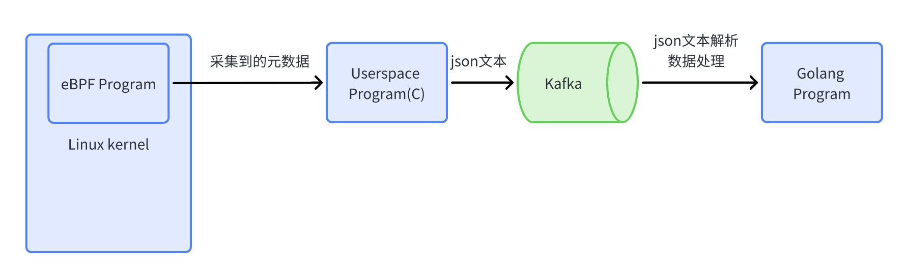

# ebpf_monitor
> 基于ebpf的Linux资源监控

## 实现功能
   利用eBPF等工具，从Linux内核中采集运行时数据，传递至用户空间进行处理及分析。
## 架构图
   


## 运行说明
0. 项目下载
    ```shell
    git clone git@github.com:sancppp/ebpf_monitor.git
    git submodule update --init --recursive # 补全依赖子模块
    ```

1. kafka容器

   ebpf程序与数据处理程序解耦。

   ```shell
   cd /
   docker-compose up -d
   docker exec -it kafka_ebpf /opt/bitnami/kafka/bin/kafka-topics.sh --create --bootstrap-server localhost:9092 --topic ${TOPIC_NAME} /bin/bash # 创建topic
   ```
   部署完成之后，访问宿主机的8081端口可以访问kafka-ui。

2. cJSON库

   将ebpf程序采集到的元数据序列化。

   ```shell
   # 1. 下载源码
   git clone git@github.com:DaveGamble/cJSON.git
   # 2. 编译，安装
   mkdir build
   cd build
   cmake ..
   make
   make install
   # 此时头文件被安装至/usr/local/include/cjson路径中，库文件被安装至/usr/local/lib。
   # 3. 使用：在C语言代码中引入头文件<cjson/cJSON.h>，在编译参数中加上-lcjson链接（makefile中已经配置好了）
   
   # 踩坑：凡是对路径上含有 lib* 的文件进行写入修改的，关闭文件后都要在终端输入：`sudo ldconfig`，让这个 library 能被找到。
   ```

3. Librdkafka库

   C语言操作kafka

   ```shell
   # 安装指南：https://github.com/confluentinc/librdkafka/tree/master#installation
   # 使用：在C语言代码中引入头文件<librdkafka/rdkafka.h>，在编译参数中加上-lrdkafka链接（makefile中已经配置好了）
   ```

4. golang程序

   ```shell
   cd gosrc
   go build
   ./epbf_monitor
   ```

   